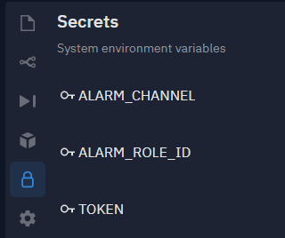

# InvasionBot 
#### WARFRAME稀有入侵偵測機器人
### 限定在REPL.IT上使用 會使用到REPL.IT上自帶的DATABASE
### 請安裝下列的套件

+ pip install flask

+ pip install OpenCC

+ pip install discord

+ pip install discord.py

+ pip install loguru

#### 安裝完畢之後的設定
#### 左方選單中replit.com的Secrets (Environment variables) 
#### 請輸入三個必要的資訊在replit.com上的Secrets
#### 1.TOKEN 2.機器人要標記的身分組ID(ALARM_ROLE_ID) 3.入侵提示頻道(ALARM_CHANNEL)
#### 弄成如下圖即可使用 細項可自行去main.py調整

#### 若要在品項前面或後面放入表情符號可以去rawDict.json修改
#### 範例:"Orokin 反應爐藍圖":""<:Reactor:88888888888888888> Orokin 反應爐藍圖"
